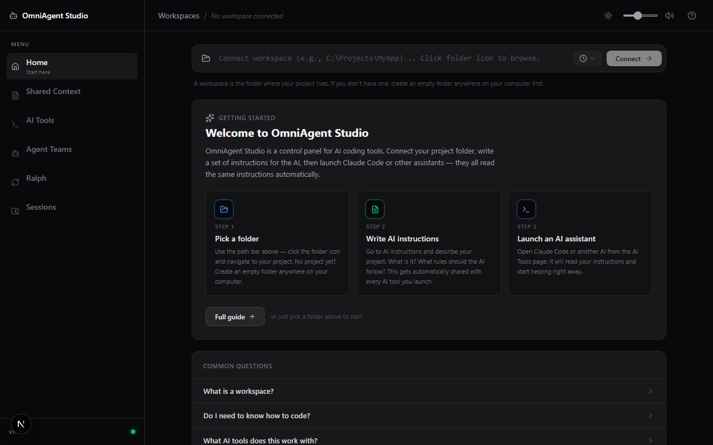

# OmniAgent Studio

## What is this?

OmniAgent Studio is a control panel for AI coding assistants. Instead of chatting with AI on a
website, the AI runs directly on your computer inside your project folder -- which means it can
actually see and edit your files. This app lets you run multiple AI assistants at the same time,
all sharing the same instructions so they stay in sync with each other.


*The home dashboard: sidebar navigation, the workspace connector, and the getting-started guide (shown in its unconnected empty state).*

---

## Before you start -- what you need

- A Windows computer (Windows 10 or newer)
- An internet connection (for the first setup only)
- A folder on your computer where you want to work (this can be any folder -- even an empty one)

That is it. The run.bat file installs everything else automatically.

---

## How to start (3 steps)

**Step 1 -- Double-click run.bat**

Find the file called `run.bat` in the OmniAgent Studio folder and double-click it. A black command
window will open. This is normal -- it is the app starting up.

If Windows asks "Do you want to allow this app to make changes to your device?" -- click Yes. This
is needed so the app can install its files.

**Step 2 -- Wait for the setup to finish (first time only)**

The first time you run it, the app needs to download and install some files. This takes about
1 to 2 minutes. You will see messages scrolling by -- this is normal. Do not close the window.

If Node.js (a program the app needs) is not already on your computer, it will also be downloaded
and installed automatically. You may see another security prompt -- click Yes to allow it.

**Step 3 -- The app opens in your browser**

When setup is done, your browser will open automatically at http://localhost:3000 and you will see
the OmniAgent Studio home page. The black command window stays open in the background -- do not
close it while you are using the app.

**What success looks like:** You see a dark-themed page with a sidebar on the left and a welcome
message in the center.

---

## First time in the app

**1. Connect your workspace**

A "workspace" is just the folder on your computer where your project lives. It could be a folder
with code files, documents, or anything you want the AI to help with.

On the home page, click the folder icon (top of the page) and choose your project folder. Once
selected, the app remembers this folder so the AI knows where to look when you ask it to do things.

**2. Write your AI instructions**

Click "Shared Context" in the left sidebar. This is a big text editor where you write instructions
for the AI -- things like what your project is about, what rules to follow, and what the goal is.

Think of it like leaving a note for a helper who is about to start working on your project. The
more detail you write, the better the AI will understand what you need. When you are done, the app
saves your instructions automatically (you will see a small "Saved" message).

**3. Launch an AI assistant**

Click "AI Tools" in the left sidebar. You will see cards for different AI assistants (Claude Code,
Gemini, etc.). Click the one you want and a new terminal window will open -- the AI is now running
inside your project folder, ready to help.

If you have not installed an AI tool yet, see the "Installing AI tools" section below.

---

## Installing AI tools (optional)

You do not need to install any AI tools to open OmniAgent Studio -- the app itself will start and
work without them. You only need an AI tool installed when you click "Launch" on the Tools page.

Each AI tool is a separate program made by a different company. Here is a plain-English guide to
each one:

**Claude Code -- Made by Anthropic. Great for almost everything. Free to try.**
Claude Code is one of the most capable AI coding assistants available. You get a free trial when
you sign up, and it can read, write, and edit code files directly.

**Gemini CLI -- Made by Google. Free with a Google account. Great for reading large projects.**
Gemini CLI is Google's AI assistant. It is completely free if you have a Google account and is
especially good at understanding large amounts of code at once.

**Codex CLI -- Made by OpenAI. Requires an OpenAI account.**
Codex is OpenAI's coding assistant. You will need an OpenAI account and may need to add payment
information depending on usage.

**OpenCode -- Requires an OpenAI API key.**
OpenCode is an open-source AI tool that uses OpenAI's models. It requires an API key from OpenAI.

### How to install an AI tool

You install AI tools using PowerShell. PowerShell is a built-in Windows program for running
commands -- think of it like a more powerful version of the command window.

**What is PowerShell?** It is already on your Windows computer. To open it: press the Windows key,
type "PowerShell", and click on "Windows PowerShell" in the results. A blue or dark window opens.
You can paste commands into it by right-clicking inside the window.

**To install Claude Code:**
Open PowerShell and paste this command, then press Enter:
```
npm install -g @anthropic-ai/claude-code
```
When it finishes, type this and press Enter to log in:
```
claude login
```
Follow the steps it shows you (it will open your browser to sign in).

**To install Gemini CLI:**
```
npm install -g @google/gemini-cli
```
Then type `gemini` and press Enter -- it will ask you to sign in with your Google account.

**To install Codex CLI:**
```
npm install -g @openai/codex
```

**To install OpenCode:**
```
npm install -g opencode-ai
```

After installing, go back to OmniAgent Studio and click "Launch" on the Tools page for that tool.

---

## Troubleshooting

**Q: The app won't start -- the black window closes immediately**

This usually means Node.js did not install correctly. Try these steps:
1. Download Node.js manually from https://nodejs.org/en/download -- choose the version labelled "LTS"
2. Run the Node.js installer and accept all the defaults
3. Restart your computer
4. Double-click run.bat again

**Q: I see a "permission denied" error**

Right-click run.bat and choose "Run as administrator". If that still does not work, check if your
company or school has software that blocks programs from running.

**Q: The browser doesn't open automatically**

The app is still running -- your browser just did not open on its own. Open any browser (Chrome,
Edge, Firefox) and go to: http://localhost:3000

**Q: npm install failed**

This means the app could not download its files. Check:
- Is your internet connection working?
- Is antivirus software blocking it? Try temporarily turning off real-time protection and run
  run.bat again (remember to turn it back on after).

**Q: An AI tool won't open / shows an error**

- Make sure you installed the tool by following the steps in "Installing AI tools" above
- Make sure you logged in to the tool after installing it (each tool has a login step)
- Try opening PowerShell and running the tool's name directly (e.g., type `claude` and press Enter)
  to see the exact error message

**Q: What is a "workspace"?**

A workspace is just a folder on your computer. It is the folder where your project files are.
OmniAgent Studio needs to know which folder you are working in so the AI can read and edit the
right files. You can set it to any folder -- it does not have to contain code.

**Q: Do I need to pay for this?**

OmniAgent Studio itself is free and open source -- there is no cost to use the app. However, the
AI tools it connects to may have their own pricing:
- Claude Code: free trial, then paid
- Gemini CLI: free with a Google account
- Codex CLI: requires an OpenAI account (may have usage costs)
- OpenCode: requires an OpenAI API key (usage costs apply)

**Q: Can I use this on Mac or Linux?**

OmniAgent Studio is built for Windows. Some parts may not work correctly on Mac or Linux because
the app uses Windows-specific features to open terminal windows and launch AI tools.

---

## Stopping the app

To stop OmniAgent Studio, find the black command window that opened when you ran run.bat and close
it (click the X in the corner). The browser tab will no longer work after you do this.

To start the app again, just double-click run.bat -- it is much faster after the first time.

---

## For developers (advanced)

You do not need this section if you are using run.bat. This is for developers who want to run the
app from source using standard developer tools.

**Requirements:** Node.js 20 or newer, npm

```bash
npm install
npm run dev
```

The app will start at http://localhost:3000.

**Tech stack:** Next.js 16 (App Router), React 19, TypeScript, Tailwind CSS v4, Framer Motion

**Project folder layout:**
- `app/` -- Next.js pages and API routes
- `components/` -- Reusable UI components
- `scripts/` -- Setup scripts
- `.claude.md` -- Shared AI instructions file (synced to `.gemini.md` and `agents.md`)
